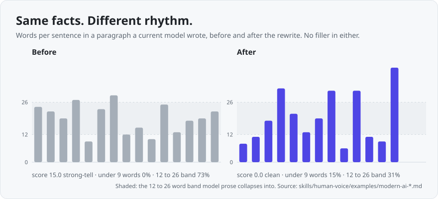
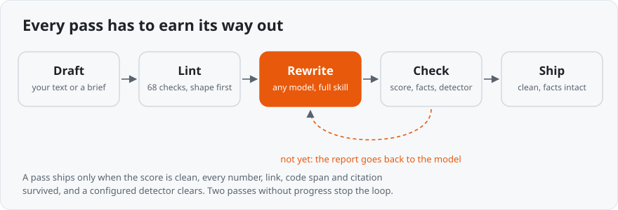
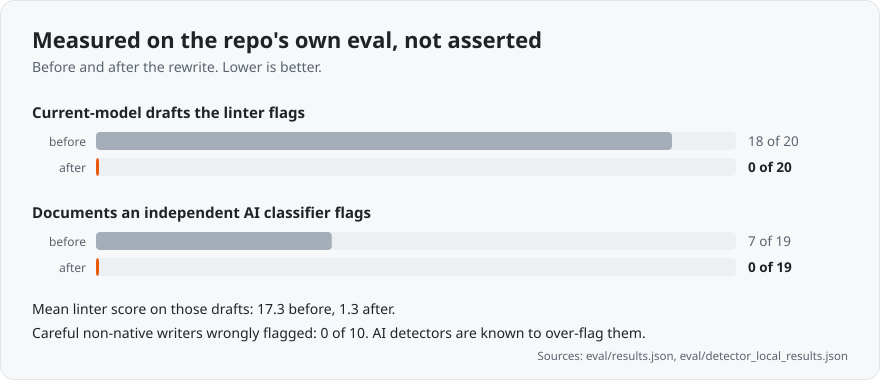
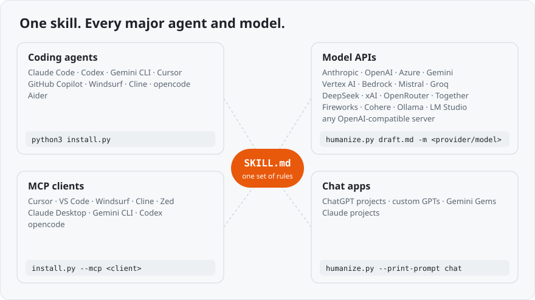

<p align="center">
  <picture>
    <source media="(prefers-color-scheme: dark)" srcset="docs/assets/logo-dark.svg">
    
  </picture>
</p>

<p align="center">
  <a href="https://github.com/stephenoffer/human-voice/actions/workflows/test.yml"></a>
  
  
  
  
</p>

<p align="center">
  <a href="#see-it-work">See it work</a> ·
  <a href="#why-its-different">Why it's different</a> ·
  <a href="#proof">Proof</a> ·
  <a href="#install">Install</a> ·
  <a href="docs/usage.md">Docs</a>
</p>

Readers can tell when a machine wrote something. The giveaway stopped being
"delve" a while ago. A current model writes fluent prose with no filler at all,
and it still reads machine-made, because its sentences all land in the same
length band and its documents come out shaped like chat answers.

**human-voice** rewrites for what actually gives AI away. It fixes shape and
rhythm first, substance next, word choice last. Every number, link, code span and
citation gets checked against your source, so a rewrite can't quietly change a
fact. When a draft needs a specific it doesn't have, you get `[SOURCE NEEDED]`,
never an invented one.

It runs where you already work: Claude Code, Codex, Cursor, Copilot, Gemini CLI
and four more agents, or any major model through a plain API key.

## See it work

A paragraph from a real model, with no filler, no hedging and no em-dashes:

```text
BEFORE
For most teams under ten million vectors, pgvector is the right
starting point. You already have backups, monitoring, and access
control for Postgres. Adding a second stateful system is a real cost
that tends to get underestimated during the prototype phase, when the
dataset is small and everything is fast.
```

```text
AFTER
Start with pgvector. Under about ten million vectors it wins, and the
reason has nothing to do with recall benchmarks: it is the database
you already back up, already monitor, already have access control
for. A second stateful system is a cost that arrives months after the
prototype, when the dataset is small and every query is fast and
nobody is thinking about it.
```

The verdict moved to the front. Nothing was invented. And the thing no word list
can see changed underneath:

<p align="center">
  <picture>
    <source media="(prefers-color-scheme: dark)" srcset="docs/assets/rhythm-dark.svg">
    
  </picture>
</p>

That chart comes from the full document the excerpt belongs to
([before](skills/human-voice/examples/modern-ai-before.md),
[after](skills/human-voice/examples/modern-ai-after.md)). Its score went from 15.0
to 0. There are before/after pairs for every genre in
[`examples/`](skills/human-voice/examples/).

## Why it's different

Three kinds of tool get lumped together here. None of them does this job.

| | human-voice | Humanizer apps | Prose linters | AI detectors |
|---|:-:|:-:|:-:|:-:|
| Rewrites the text | ✓ | ✓ | ✗ | ✗ |
| Fixes structure and rhythm, not just words | ✓ | ◐ | ✗ | ✗ |
| Proves numbers, links and citations survived | ✓ | ✗ | ✗ | ✗ |
| Marks a missing fact instead of inventing one | ✓ | ✗ | ✗ | ✗ |
| Never uses homoglyphs, typos or synonym mangling | ✓ | ◐ | ✓ | ✓ |
| Writes to the genre: docs, marketing, email, fiction | ✓ | ◐ | ◐ | ✗ |
| Works with your model and your agent | ✓ | ✗ | ✓ | ✗ |
| Open source, free, runs offline | ✓ | ✗ | ✓ | ✗ |
| Published eval on prose a current model writes | ✓ | ✗ | ✗ | ◐ |

✓ yes · ◐ partly or sometimes · ✗ no

**Humanizer apps sell a bypass rate.** When one detector vendor tested 19 of
them, five were caught every time. The ones that slip through do it by damaging
the text: odd synonyms, invisible characters, planted typos. That damage is its
own fingerprint, and the reader pays for it. human-voice has no bypass rate to
sell. It makes the prose better, which is the only version of the goal that lasts.

**Prose linters nitpick sentences.** proselint, write-good, Vale and Hemingway
catch weak words and long sentences. None has a theory of what gives a model
away, and none rewrites. human-voice ships a linter too (68 checks, zero
dependencies, ready for CI), but the linter is the floor, not the product.

**Detectors only judge.** They can't fix anything, and they misfire on careful
non-native writers. human-voice treats a detector as a gate, never as ground
truth. Point it at GPTZero, Originality, Sapling or Winston and the rewrite loops
until the text clears or stops improving.

The full survey covers about a hundred tools and papers, including what got
tested and thrown out: [docs/comparison.md](docs/comparison.md).

## How it works

<p align="center">
  <picture>
    <source media="(prefers-color-scheme: dark)" srcset="docs/assets/loop-dark.svg">
    
  </picture>
</p>

The order comes from the evidence. Detectors respond to what instruction tuning
leaves behind, which is formatting habits and reply-shaped structure. Base models
that never went through it pass as human more than 96% of the time. So the
rewrite strips the assistant shape first: the heading every eighty words, the
bulleted answer, the "Key takeaways" close. Then it fixes the sentence-length
distribution. Diction comes last, because swapping "delve" for "explore" barely
moves anything. More in [docs/evidence.md](docs/evidence.md).

Longer documents get a structure pass before any sentence is touched. An agent
fills an outline to quota, so its overview comes back as the summary, the easy
section runs four hundred words while rollback gets one line, and one section
quotes config keys while the next could describe any system. The pass maps what
each section says, merges repeats, weighs sections by what a reviewer will ask,
and holds one depth throughout. It never deletes a claim that appears only once
without asking you first.

Genre comes first too. A technical report stays professional and a landing page
talks to "you". Ten register profiles share one core of tells that get fixed
everywhere.

## Proof

<p align="center">
  <picture>
    <source media="(prefers-color-scheme: dark)" srcset="docs/assets/results-dark.svg">
    
  </picture>
</p>

The chart is generated from the committed eval output, and CI fails if those
metrics drift. The classifiers run locally on open models, with nothing sent
anywhere. The honest limits: n is small, the corpus has one author,
and no tool can promise a text is undetectable. This one checks instead of
promising. Details and caveats: [docs/evidence.md](docs/evidence.md).

## Install

<p align="center">
  <picture>
    <source media="(prefers-color-scheme: dark)" srcset="docs/assets/everywhere-dark.svg">
    
  </picture>
</p>

**Claude Code**

```
/plugin marketplace add stephenoffer/human-voice
/plugin install human-voice@human-voice
```

**Codex, Cursor, Copilot, Gemini CLI, Windsurf, Cline, opencode, Aider**

```bash
git clone https://github.com/stephenoffer/human-voice.git && cd human-voice
python3 install.py            # finds your agents and installs for each one
```

**Any model, no agent** (CI jobs, scripts, batch rewrites)

```bash
export OPENAI_API_KEY=...     # or Anthropic, Gemini, Bedrock, Mistral, xAI, a local Ollama...
python3 skills/human-voice/scripts/humanize.py draft.md -o draft.human.md
```

MCP clients, Gemini extensions, ChatGPT projects, the Python API and all
seventeen providers: [docs/install.md](docs/install.md). Everything runs on the
Python standard library.

## Use it

In an agent, invoke `/human-voice` or just ask it to humanize something:

```
/human-voice launch-post.md
/human-voice generate register: marketing  "announce the new export API"
```

It picks the genre, sizes the effort to the job (a commit message gets a quick
pass, a landing page gets the full treatment) and hands back the rewrite with an
audit. Then it stays on for the rest of the session, so the next document doesn't
slide back into the default voice.

Gate prose in CI with the linter on its own:

```bash
python3 skills/human-voice/scripts/detect_ai_prose.py --register auto --fail-over 5 docs/
```

Flags, autofix, the detector gate, per-project config and how the score works:
[docs/usage.md](docs/usage.md).

## What it won't do

It improves writing. It does not disguise machine text. No Unicode homoglyphs, no
zero-width characters, no deliberate typos, no synonym swaps that degrade meaning.
It never invents a fact or fakes a quote to seem human. Passing a detector is a
side effect of good writing, not the objective.

## Docs

| | |
|---|---|
| [Install](docs/install.md) | every agent, every provider, MCP, chat apps, Python |
| [Usage](docs/usage.md) | modes, registers, the linter, autofix, detector gate, scoring |
| [Evidence](docs/evidence.md) | what detectors respond to, and the measured results |
| [Comparison](docs/comparison.md) | humanizers, linters, detectors, and the full survey |
| [SKILL.md](skills/human-voice/SKILL.md) | the rules themselves |
| [Eval](eval/EVAL.md) | corpus, method, and every number |

## Contributing

See [CONTRIBUTING.md](CONTRIBUTING.md) and [CHANGELOG.md](CHANGELOG.md). Run
`make test`. The suite runs on Python 3.8 through 3.13 in CI. Regenerate the charts
with `python3 docs/assets/make_visuals.py`.

The v0.4 recalibration ranks tells by what readers *cite* as AI rather than what a
scanner *matches*. It draws on two MIT-licensed projects,
[vibecoded-design-tells](https://github.com/JCarterJohnson/vibecoded-design-tells)
and [oberskills](https://github.com/ryanthedev/oberskills), plus the ~90k-post
study behind them.

MIT licensed. See [LICENSE](LICENSE).
